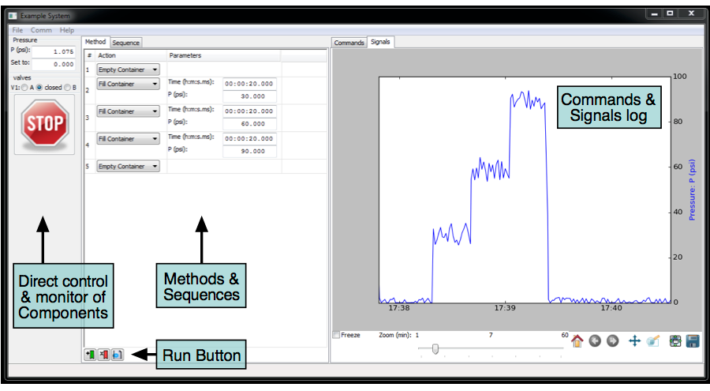
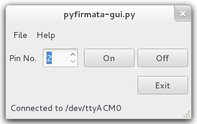
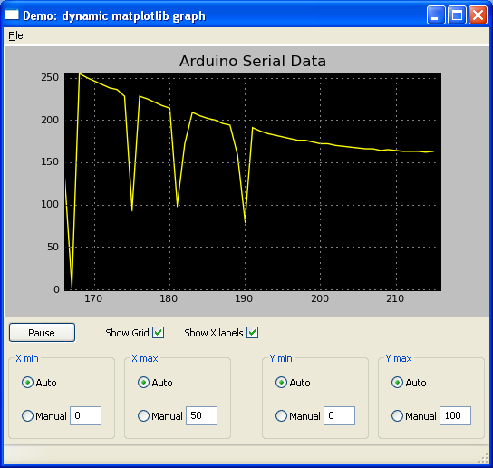
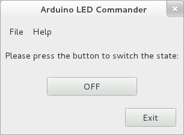

# Arduino_and_Python
> GitHub@[orca-j35](https://github.com/orca-j35)，所有笔记均托管在 [arduino-notes](https://github.com/orca-j35/arduino-notes) 仓库

在 Python 中使用串行接口与Arduino对话是非常简单的。
在类 Unix系统上，你可以读取和写入串行设备，就好像它是一个文件，但是这还有一个叫做 **pySerial** 的封装库，可以在所有操作系统中使用。

在安装 pySerial 后，从arduino读取数据非常简单。
```
>>> import serial
>>> ser = serial.Serial('/dev/tty.usbserial', 9600)
>>> while True:
...     print ser.readline()
'1 Hello world!\r\n'
'2 Hello world!\r\n'
'3 Hello world!\r\n'
```
像arduino写入数据也同样非常简单(以下适用于Python2.x)

```
>>> import serial # if you have not already done so
>>> ser = serial.Serial('/dev/tty.usbserial', 9600)
>>> ser.write('5')
```

在Python 3.x中默认使用 Unicode 字符串。向arduino发送数据时，字符必须被串被转换为字节。可以通过在字符串前增加前缀‘b’来完成转换。
```
>>> ser.write(b'5') # prefix b is required for Python 3.x, optional for Python 2.x
```
注意：您需要连接到你在Arduino开发环境中连接到的相同设备。我在冗长的设备名和 /dev/tty.usbserial 之间创建了连接符号以减少点击。

值得注意的是，上面的例子将不能在windows设备上工作；Arduino 串行设备需要一些时间加载，并且当串行连接被建立时，它会重置arduino。

在设备初始化之前任何 write()命令发出的信息都将被丢失。一个健壮的服务器端脚本将从串口读取数据，直到Arduino申明自己已经准备好，然后发送写入命令。或者可以通过在串行连接和写调用之间简单放置一个  'time.sleep(2)' 调用，来变通的解决这个问题。

## [Python Arduino Prototyping API v2](https://github.com/vascop/Python-Arduino-Proto-API-v2)

一个更新版的 Arduino Prototyping API 库用于在Python中快速原型话一个 Arduino 基础应用。


## [Instrumentino](http://www.chemie.unibas.ch/~hauser/open-source-lab/instrumentino/index.html)


Instrumentino 是一个开源的模块化的图形用户界面框架，用于控制基于arduino的实验仪器。它用于扩展arduino的控制功能，允许仪器的建造者在所连接的PC上轻松的创建自定义的用户界面程序。它使您能够定义操作序列和及其自动运行，并且无需用户干预。获取的实验数据和使用日志被自动保存在计算机上，以供进一步分析。使用Python编程语言允许轻松的进行扩展。使用arduino难以控制的复杂设备，也可以通过将第三方应用编程接口结合到 Instrumentino 框架中来集成。
连接
[Official page](http://www.chemie.unibas.ch/~hauser/open-source-lab/instrumentino/index.html)
[Release article](http://www.sciencedirect.com/science/article/pii/S0010465514002112)
[Package in PyPi](https://pypi.python.org/pypi/instrumentino/1.0)
[Code in GitHub](https://github.com/yoelk/instrumentino)

## [Python Firmata](http://github.com/lupeke/python-firmata/)
Firmata协议的Python API。 它基于Arduino的处理库并支持Firmata v2.0

## [pyFirmata](https://github.com/tino/pyFirmata)
Firmata协议的Python API。 其符合Firmata2.1
[Documentation](https://github.com/tino/pyFirmata/blob/master/README.rst)
[Examples (by Fabian)](https://bitbucket.org/fab/pyfirmata/src/96116e877527/examples/)

(GUI 可以使用gtk创建，但是示例中不包含GUI)

## Py2B
实现一个简单的 2 ASCII 字符协议。
开始玩 Python 和Arduino 到 Py2B。
http://playground.arduino.cc/Code/2B

## [arduinoserial.py](https://github.com/wiseman/arduino-serial)
arduinoserial.py 是一个库和命令行，它允许你与arduino板卡通讯，而无需安装任何额外的Python模块。

Turn your Arduino into an IRC bot with python.
http://blog.datasingularity.com/?p=148

Control Arduino using HTML forms via Python.
http://blog.datasingularity.com/?p=50

Arduino-Python 4-Axis Servo Control: with a good general explanation of how to coordinate Arduino and Python code.
http://principialabs.com/arduino-python-4-axis-servo-control/

Here is an Arduino serial utility for BSDish systems that is written in python.
http://blog.datasingularity.com/?p=64

Control Arduino using this Python-SimpleMessageSystem library.
http://www.arduino.cc/cgi-bin/yabb2/YaBB.pl?num=1199237936/0

## 通过串口实时图形化数据
Realtime graphing of data over serial

Graphing realtime data from an Arduino using Python and Matplotlib: http://www.blendedtechnologies.com/realtime-plot-of-arduino-serial-data-using-python

## Python和Qt / PyQt的线程GUI示例
A threaded GUI example with Python and Qt/PyQt

A simple example/tutorial of a threaded GUI displaying information from the Arduino. http://blog.wickeddevice.com/?p=191

## A simple UI with Python and GTK
“Arduino LED commander” is a simple GUI for controlling an output pin of the Arduino. This project was made as a little tutorial/example to show the possibility of controlling an Arduino board with Python and a GTK interface.

Details: http://fabian-affolter.ch/blog/index.php/arduino-controlled-by-a-gtk
Source: http://www.gitorious.org/arduino-led
Video: http://youtu.be/WZ9FKHfVKRY

## PyCmdMessenger

PyCmdMessenger https://github.com/harmsm/PyCmdMessenger is a simple, but powerful, interface for reliably sending commands and data to and from an Arduino over a serial connection using Python3. The user should use CmdMessenger http://playground.arduino.cc/Code/CmdMessenger define commands and callbacks on the Arduino. These can then be accessed by PyCmdMessenger using a clean API.