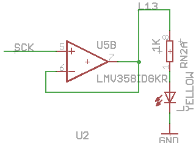

# Digital IO 数字 IO
> GitHub@[orca-j35](https://github.com/orca-j35)，所有笔记均托管在 [arduino-notes](https://github.com/orca-j35/arduino-notes) 仓库


## 1. pinMode()
描述
将指定的引脚配置成输出或输入。
详情请见 digital pins on the functionality of the pins
https://www.arduino.cc/en/Tutorial/DigitalPins

截止 Arduino 1.0.1, 可使用 INPUT_PULLUP 模式开启内部上拉电阻。此外，INPUT 模式明确禁止内部上拉电阻。

语法Syntax
pinMode(pin, mode)

参数Parameters
pin: the number of the pin whose mode you wish to set
mode: INPUT, OUTPUT, or INPUT_PULLUP. (see the digital pins page for a more complete description of the functionality.)
https://www.arduino.cc/en/Reference/Constants
https://www.arduino.cc/en/Tutorial/DigitalPins

返回值 Returns
None

示例 Example
```
int ledPin = 13;                 // LED connected to digital pin 13

void setup()
{
  pinMode(ledPin, OUTPUT);      // sets the digital pin as output
}

void loop()
{
  digitalWrite(ledPin, HIGH);   // sets the LED on
  delay(1000);                  // waits for a second
  digitalWrite(ledPin, LOW);    // sets the LED off
  delay(1000);                  // waits for a second
}
```

注意 Note
模拟输入引脚可以被用作数字引脚，针对 A0, A1，等
The analog input pins can be used as digital pins, referred to as A0, A1, etc.

Configures the specified pin to behave either as an input or an output. See the description of digital pins for details on the functionality of the pins.

As of Arduino 1.0.1, it is possible to enable the internal pullup resistors with the mode INPUT_PULLUP. Additionally, the INPUT mode explicitly disables the internal pullups.

## 2. digitalWrite()
描述：
向 digital 引脚写入 HIGH 或 LOW 值。
假如该引脚被配置为输出引脚，那么电压会被设置为相应的值：5V (or 3.3V on 3.3V boards) for HIGH, 0V (ground) for LOW.

假如引脚被配置为 INPUT，digitalWrite() 将会在input 引脚开启(HIGH) 或关闭 (LOW) 内部上拉电阻。
推荐开始内部上拉电阻时使用 pinMode() 设置 INPUT_PULLUP。
参考 digital pins tutorial 以获得更多信息。
https://www.arduino.cc/en/Tutorial/DigitalPins

注意：如果没有通过 pinMode() 将引脚设置为 OUTPUT，并且在该引脚连接了一个 LED ，当调用 diditalWrite(HIGH)，这个LED 会显示微弱的亮光。如果没有明确设置 pinMode()，digitalWrite() 将会开启内部上拉电阻，该电阻此时类似一个大的限流电阻。
uno 数字 13 连接运放，通过运放控制LED ，和之前的 arduino 设计不同，所以不存在以下问题。但是在 nano/micro 上会直接连接 led ，仍存在以下问题

注意：数字13号引脚难以作为数字输入使用，因为大部分的控制板上使用了一颗LED与一个电阻连接到他。如果启动了内部的20K上拉电阻，他的电压将在1.7V左右，而不是正常的5V，因为板载LED串联的电阻把他使他降了下来，这意味着他返回的值总是LOW。如果必须使用数字13号引脚的输入模式，需要使用外部上拉下拉电阻。

语法 Syntax
digitalWrite(pin, value)

参数 Parameters
pin: the pin number
value: HIGH or LOW

返回值 Returns
none

Example
```
int ledPin = 13;                 // LED connected to digital pin 13

void setup()
{
  pinMode(ledPin, OUTPUT);      // sets the digital pin as output
}

void loop()
{
  digitalWrite(ledPin, HIGH);   // sets the LED on
  delay(1000);                  // waits for a second
  digitalWrite(ledPin, LOW);    // sets the LED off
  delay(1000);                  // waits for a second
}
```
设置引脚 13 为 high，延迟 1秒钟，然后设置该引脚为low

**注意 Note**
模拟输入引脚可以用作数字引脚，称为 A0/A1等等。

Description
Write a HIGH or a LOW value to a digital pin.

If the pin has been configured as an OUTPUT with pinMode(), its voltage will be set to the corresponding value: 5V (or 3.3V on 3.3V boards) for HIGH, 0V (ground) for LOW.

If the pin is configured as an INPUT, digitalWrite() will enable (HIGH) or disable (LOW) the internal pullup on the input pin. It is recommended to set the pinMode() to INPUT_PULLUP to enable the internal pull-up resistor. See the digital pins tutorial for more information.

NOTE: If you do not set the pinMode() to OUTPUT, and connect an LED to a pin, when calling digitalWrite(HIGH), the LED may appear dim. Without explicitly setting pinMode(), digitalWrite() will have enabled the internal pull-up resistor, which acts like a large current-limiting resistor.

Sets pin 13 to HIGH, makes a one-second-long delay, and sets the pin back to LOW.

The analog input pins can be used as digital pins, referred to as A0, A1, etc.

## 3. digitalRead()
**描述 Description**
Reads the value from a specified digital pin, either HIGH or LOW.
读取指定引脚的值，HIGH或LOW。
**语法Syntax**
digitalRead(pin)

**Parameters**
pin: the number of the digital pin you want to read (int)

**Returns**
HIGH or LOW

**Example**
Sets pin 13 to the same value as pin 7, declared as an input.
设置引脚 13 和引脚 7 的值相同，声明 7 作为输入。
```
int ledPin = 13; // LED connected to digital pin 13
int inPin = 7;   // pushbutton connected to digital pin 7
int val = 0;     // variable to store the read value

void setup()
{
  pinMode(ledPin, OUTPUT);      // sets the digital pin 13 as output
  pinMode(inPin, INPUT);      // sets the digital pin 7 as input
}

void loop()
{
  val = digitalRead(inPin);   // read the input pin
  digitalWrite(ledPin, val);    // sets the LED to the button's value
}
```

**Note**
如果引脚悬空，digitalRead()会返回HIGH或LOW（随机变化）。
模拟输入脚能当做数字脚使用，参见A0，A1等。

If the pin isn't connected to anything, digitalRead() can return either HIGH or LOW (and this can change randomly).
The analog input pins can be used as digital pins, referred to as A0, A1, etc.