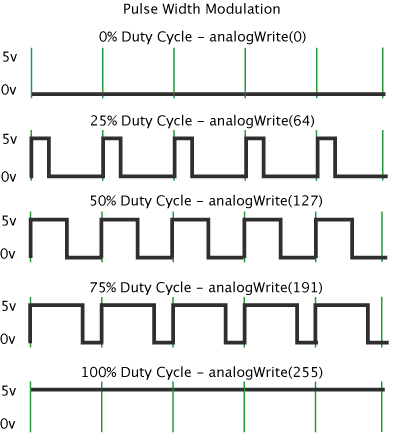

# PWM
> GitHub@[orca-j35](https://github.com/orca-j35)，所有笔记均托管在 [arduino-notes](https://github.com/orca-j35/arduino-notes) 仓库

 Fading(褪色)示例演示了使用模拟输出(PWM)让 LED 的亮度逐渐变暗。
 可在 Arduino 软件的 File->Sketchbook->Examples->Analog 菜单项中获得该示例文件。

 PWM 脉冲宽度调制，是以数字化的方式获取模拟值的一种技术。
 数字化控制用于创建一个方波，信号在 on 和 off 之间切换。
 通过改变时间的比例，on-off 模式可以模仿全开(5 Volts) 和 off (0 Volts) 之间的电压。该时间比例指信号花费在 on 上的时间和信号花费在 off 上的时间的比例。
持续的 on time 被称作脉冲宽度。
为了得到变化的模拟值，你可以改变或调整脉冲宽度。
假如你在 LED 上足够快的重复  on-off 模式，其结果好像信号源具有 0 ~ 5V 的稳定用以控制 LED 的亮度。

在下图中，绿线代表一个固定的时间段。
此持续时间或周期是 PWM 频率的倒数。
换言之，Arduino 的 PWM 频率在 500Hz，每两个绿线间的距离代表 2 毫秒。
在 0~255 的范围之间调用 analogWrite() 。
analogWrite(255) 代表 100% 的占空比（始终处于高电平），analogWrite(127) 代表 50% 的占空比（一般的时间处于高电平）。

一旦你运行此示例，抓住你的 arduino 并来回摇动它。
这会在空间中映射出时间的变化。
对于我们的眼睛，快速的移动使得 LED 的闪烁变成一条线。
由于 LED 淡入和淡出，那些小行会成长或缩小其长度。
现在你看到的脉冲宽度了吧。

The Fading example demonstrates the use of analog output (PWM) to fade an LED. It is available in the File->Sketchbook->Examples->Analog menu of the Arduino software.

Pulse Width Modulation, or PWM, is a technique for getting analog results with digital means. Digital control is used to create a square wave, a signal switched between on and off. This on-off pattern can simulate voltages in between full on (5 Volts) and off (0 Volts) by changing the portion of the time the signal spends on versus the time that the signal spends off. The duration of "on time" is called the pulse width. To get varying analog values, you change, or modulate, that pulse width. If you repeat this on-off pattern fast enough with an LED for example, the result is as if the signal is a steady voltage between 0 and 5v controlling the brightness of the LED.

In the graphic below, the green lines represent a regular time period. This duration or period is the inverse of the PWM frequency. In other words, with Arduino's PWM frequency at about 500Hz, the green lines would measure 2 milliseconds each. A call to analogWrite() is on a scale of 0 - 255, such that analogWrite(255) requests a 100% duty cycle (always on), and analogWrite(127) is a 50% duty cycle (on half the time) for example.

Once you get this example running, grab your arduino and shake it back and forth. What you are doing here is essentially mapping time across the space. To our eyes, the movement blurs each LED blink into a line. As the LED fades in and out, those little lines will grow and shrink in length. Now you are seeing the pulse width.