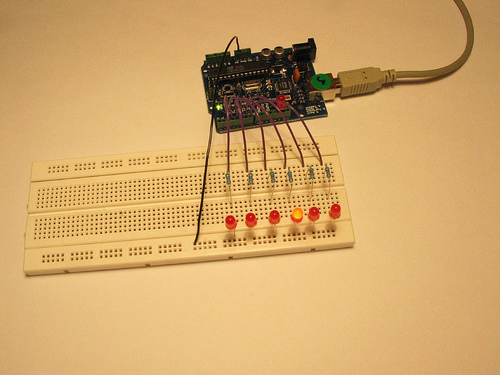

# DataTypes_数据类型
> GitHub@[orca-j35](https://github.com/orca-j35)，所有笔记均托管在 [arduino-notes](https://github.com/orca-j35/arduino-notes) 仓库


##  1. void 空
The void keyword is used only in function declarations.
It indicates表示 that the function is expected预计 to return no information to the function from which it was called.

void 关键字仅仅被用在函数的声明中。
它表示该函数不会返回任何信息到调用它的函数中。

Example:
```
// actions are performed in the functions "setup" and "loop"
// 功能在“setup”和“loop”被执行
// but  no information is reported to the larger program
// 但没有数据被返回到高一级的程序中

void setup()
{
  // ...
}

void loop()
{
  // ...
}

```

## 2. boolean 布尔值
A boolean holds one of two values, true or false. 
(Each boolean variable occupies占用 one byte of memory.)

一个布尔值表示真/假两种状态之一。
（每个布尔变量占用一个字节的内存。）
注意：占用1个字节
Example
```
int LEDpin = 5;       // LED on pin 5
int switchPin = 13;   // momentary瞬时 switch on 13, other side connected连接 to ground

boolean running = false;

void setup()
{
  pinMode(LEDpin, OUTPUT);
  pinMode(switchPin, INPUT);
  digitalWrite(switchPin, HIGH);      
  // turn on pullup resistor
}

void loop()
{
  if (digitalRead(switchPin) == LOW)
  {  // switch is pressed按下 - pullup弹起 keeps pin high normally
    delay(100);                        // delay to debounce防反跳 switch 瞬动开关稳定下来
    running = !running;                // toggle running variable
    digitalWrite(LEDpin, running)      // indicate via LED
  }
}
```

## 3. char 字符
该数据类型占用 1 个字节的内存，存储一个字符值。
字符文本都卸载单引号内：像是 'A' (对于多个字符-像字符串-使用双引号："ABC")
任何时候，字符都以数值的形式存储。
可以在 ASCII 图标中参看字符的特定编码。
这意味着，字符可以进行四则运算，在计算过程中使用 ASCII 值( 例如：'A' + 1 的值是66，因为大写字母 A 的 ASCII 值是 65)。
阅读 Serial.println 的参考文档，以了解如何将字符转换为数值。(以十进制的形式发送字符，即可将其转换为相应的数值)
char数据类型是有符号的类型，这意味着它的编码为-128到127。对于一个无符号一个字节（8位）的数据类型，使用byte数据类型。

Example
```
char myChar = 'A';
char myChar = 65;      // both are equivalent相等
```

>A data type that takes up占用 1 byte of memory that stores a character字符 value. 
>Character literals文本 are written in single单 quotes引号, like this: 'A' (for multiple characters - strings - use double quotes: "ABC").
>Characters are stored as numbers however. 
>You can see the specific特定的 encoding编码 in the ASCII chart图表. 
>This means that it is possible to do arithmetic on characters, in which the ASCII value of the character is used (e.g. 'A' + 1 has the value 66, since the ASCII value of the capital letter A is 65). 
>See Serial.println reference for more on how characters are translated转换 to numbers.
>The char datatype is a signed有符号 type, meaning that it encodes编码 numbers from -128 to 127. 
>For an unsigned, one-byte (8 bit) data type, use the byte data type.


##4. unsigned char 无符号字符
无符数据类型，占用 1 字节的内存。
与 byte 数据类型相同。
无符号的char数据类型能编码0到255的数字。
为了保持Arduino的编程风格的一致性，byte数据类型是首选。

Example
```
unsigned char myChar = 240;
```

>An unsigned data type that occupies占用 1 byte of memory. 
>Same as the byte datatype.
>The unsigned char datatype数据类型 encodes numbers from 0 to 255.
>For consistency一致性 of Arduino programming style, the byte data type is to be preferred首选.

##5. byte 
占用一个字节，可存储 8-bit 无符号数，从 0 到 255。
A byte stores an 8-bit unsigned number, from 0 to 255.

Example
```
byte b = B10010;  // "B" is the binary formatter (B10010 = 18 decimal)
```

##6. int
整型作为数值存储的主要数据类型。
在 Arduini Uno（和其它 ATMega 板卡上）int 存储 16-bit (2-byte)的值。
整数的范围-32,768到32,767（ -2^15 ~（2^15)-1）。

在 Arduino Due 上，int 存储 32-bit (4-byte) 的值，
整数的范围 2,147,483,648 to 2,147,483,647 (minimum value of -2^31 and a maximum value of (2^31) - 1).

int 使用 2 的补码运算的技术存储负数。
最高位通常为符号位，标记该数值作为一个负数。
其余位被“取反加1”（此处请参考补码相关资料，不再赘述）。 

Arduino为您处理负数计算问题，所以数学计算对您是透明的（术语：实际存在，但不可操作。相当于“黑盒”）。
但是，当处理右移位运算符（»）时，在处理过程中可能会导致意外的混乱。

Example
int ledPin = 13;

语法：int var = val;
var - your int variable name
val - the value you assign分配 to that variable

编码提示：
当变量数值过大而超过整数类型所能表示的范围时（-32,768到32,767），变量值会“回滚”（详情见示例）。
当变量值超过最大容量值时会  "roll over翻转" 到最小的值，注意这种“回滚”发生在两个方向上。

Example for a 16-bit int:
```
   int x;
   x = -32768;
   x = x - 1;       // x now contains等于 32,767 - rolls over in neg.相反 direction

   x = 32767;
   x = x + 1;       // x now contains -32,768 - rolls over
```

>Integers are your primary data-type for number storage.
>On the Arduino Uno (and other ATMega based boards) an int stores a 16-bit (2-byte) value. This yields产生 a range of -32,768 to 32,767 (minimum value of -2^15 and a maximum value of (2^15) - 1). 
>On the Arduino Due, an int stores a 32-bit (4-byte) value. This yields a range of -2,147,483,648 to 2,147,483,647 (minimum value of -2^31 and a maximum value of (2^31) - 1).
>int's store negative numbers with a technique技术 called 2's complement补码 math运算. 
>The highest bit, sometimes referred称为 to as the "sign" bit, flags标记 the number as a negative number. 
>The rest of the bits are inverted and 1 is added.
>The Arduino takes care负责 of dealing处理 with negative numbers for you, so that arithmetic算数 operations运算 work transparently透明的 in the expected预期 manner方式. 
>There can be an unexpected意外 complication混乱 in dealing处理 with the bit shift right operator运算符 (>>) however.

Coding Tip 编码提示
>When variables are made to exceed超过 their maximum capacity容量 they "roll over翻转" back to their minimum capacity, note that this happens in both directions方向. 

##7. unsigned int
在  Uno 和别的 ATMEGA 板卡上，unsigned ints (unsigned integers) 和 int 都用于存储两个字节的值。
不存储负数，而是仅仅存储正值，产生一个 0 到65,535 ((2^16) - 1) 的可用范围。
Due 存储 4 byte (32-bit) 的值， 0 to 4,294,967,295 (2^32 - 1)
无符号整型和有符号整型的区别，在于最高位的方式，一些时候会作为“符号”使用。
在 Arduino 中 int 类型(有符号)，假如最高位是 “1”，那么这个数值被认为是一个负数，另外的 15 位使用 2 的补码计算。

Example
unsigned int ledPin = 13;

Syntax
unsigned int var = val;
var - your unsigned int variable name
val - the value you assign to that variable

Coding Tip 编码提示
>When variables are made to exceed超出 their maximum capacity容量 they "roll over" back to their minimum capacitiy, note that this happens in both directions方向.
```
unsigned int x
   x = 0;
   x = x - 1;       // x now contains 65535 - rolls over in neg direction
   x = x + 1;       // x now contains 0 - rolls over
```


Description
>On the Uno and other ATMEGA based boards, unsigned ints (unsigned integers) are the same as ints in that they store a 2 byte value. 
>Instead of storing negative负 numbers however they only store positive正 values, yielding a useful range of 0 to 65,535((2^16) - 1).
>The Due stores a 4 byte (32-bit) value, ranging from 0 to 4,294,967,295 (2^32 - 1).
>The difference between unsigned ints and (signed) ints, lies in在于 the way the highest bit, sometimes referred涉及 to as the "sign" bit, is interpreted. 
>In the Arduino int type (which is signed), if the high bit is a "1", the number is interpreted解释 as a negative number, and the other 15 bits are interpreted with 2's complement补码 math计算.


## 8. word
On the Uno and other ATMEGA based boards, a word stores a 16-bit unsigned number. 
On the Due and Zero instead it stores a 32-bit unsigned number.

Example
word w = 10000; 

## 9. long
长整数型变量是扩展的数字存储变量，它可以存储32位（4字节）大小的变量，从-2,147,483,648到2,147,483,647。
假如做有关整型的计算，至少一个数字必须跟着 L，迫使它成为一个长整型。
查看整型常数页面以了解更多信息。
Long variables变量 are extended扩展 size variables for number storage, and store 32 bits (4 bytes), from -2,147,483,648 to 2,147,483,647.
If doing math with integers, at least one of the numbers must be followed by an L, forcing it to be a long. 
See the Integer Constants page for details详情.
https://www.arduino.cc/en/Reference/IntegerConstants

Example
```
 long speedOfLight = 186000L;   
 // see the Integer Constants page for explanation of the 'L'
 // 参见整数常量‘L’的说明
```

Syntax
long var = val;
var - the long variable name
val - the value assigned to the variable

## 10. unsigned long
Unsigned long variables are extended扩展 size variables for number storage, and store 32 bits (4 bytes). 
Unlike standard标准 longs unsigned longs won't store negative numbers, making their range from 0 to 4,294,967,295 (2^32 - 1).

- Example
```
unsigned long time;
void setup()
{
  Serial.begin(9600);
}
void loop()
{
  Serial.print("Time: ");
  time = millis();
  //prints time since program started
  Serial.println(time);
  // wait a second so as not to send massive amounts of data
  // 等待一秒钟，以致不会发送庞大的数据量
  delay(1000);
}
```
Syntax
unsigned long var = val;
var - your long variable name
val - the value you assign to that variable

## 11. short
A short is a 16-bit data-type.
On all Arduinos (ATMega and ARM based) a short stores a 16-bit (2-byte) value. 
This yields a range of -32,768 to 32,767 (minimum value of -2^15 and a maximum value of (2^15) - 1). 

和 int 一样

Example
```
short ledPin = 13;
```

Syntax
short var = val;
var - your short variable name
val - the value you assign to that variable

## 12. float
浮点数据类型，包含小数点的数值。
浮点数经常被用来近似的模拟值和连续值，因为他们比整数更大的精确度。
浮点数的取值范围在3.4028235 E+38 ~ -3.4028235E +38。
它被存储为32位（4字节）的信息。
浮点数只有 6-7 位精度的小数位数。
这是指数字的总位数，而不是小数点右侧的位数。
不像其它的平台，你可以使用 double 获得更多的精度(例如：15位数)，在Arduino ,double和float的尺寸相同。
浮点数并不精确，在比较数据的大小时，可能会产生奇怪的结果。
例如 6.0 / 3.0 可能不等于 2.0。
你应该使两个数字之间的差额的绝对值小于一些小的数字，这样就可以近似的得到这两个数字相等这样的结果。
在执行计算时，浮点运算同样比整型运算慢的多，所以如果可能就该避免浮点运算，例如，loop 有一个关键的计时功能的函数在高速运行。
程序员经常进行一些浮点运算到整型运算的长度转换来提高速度。
假如做浮点运算，你需要添加一个小数点，否则它将被处理为一个整型。
See the Floating point constants page for details.
https://www.arduino.cc/en/Reference/Fpconstants

Examples
```
	float myfloat;
    float sensorCalbrate = 1.117;
```

Syntax
float var = val;
var - your float variable name
val - the value you assign to that variable

Example Code
```
   int x;
   int y;
   float z;

   x = 1;
   y = x / 2;            // y now contains 0, ints can't hold fractions分数
   z = (float)x / 2.0;   // z now contains .5 (you have to use 2.0, not 2)
```

Datatype for floating-point numbers, a number that has a decimal小数 point. 
Floating-point numbers are often常常 used to approximate近似 analog and continuous连续 values because they have greater resolution分辨率 than integers. 
Floating-point numbers can be as large大 as 3.4028235E+38 and as low低 as -3.4028235E+38. 
They are stored as 32 bits (4 bytes) of information.
Floats have only 6-7 decimal digits of precision精度. 
That means the total number of digits, not the number to the right of the decimal point. 
Unlike other platforms, where you can get more precision by using a double (e.g. up to 15 digits), on the Arduino, double is the same size as float.
Floating point numbers are not exact精确, and may yield strange奇怪 results when compared. 
For example 6.0 / 3.0 may not equal 2.0. 
You should instead check that the absolute绝对 value of the difference差 between the numbers is less than some small number.
取而代之，你应该检查两个数之差的绝对值是小于某个较小的数。
Floating point math is also much slower than integer math in performing执行 calculations, so should be avoided if, for example, a loop has to run at top speed for a critical关键 timing function. 
Programmers often go to some lengths to convert floating point calculations to integer math to increase提高 speed.
If doing math with floats, you need to add a decimal point, otherwise it will be treated处理 as an int. 


## 13. double
双精度浮点数。
在 Uno 和 其它 ATMEGA 板卡上，占用 4 字节。
这就是说，double 的实现和 float 完全相同，没有提高精度。
在 Due ，double 有 8-byte (64 bit)  的精度。

提示：
用户从另外的原借用的代码，该代码包含 double 变量，希望检查代码看看是否隐含的精度不同于 ATMEGA based Arduinos实际达到的精度。
Double precision精度 floating point number. 
On the Uno and other ATMEGA based boards, this occupies占用 4 bytes. 
That is, the double implementation实现 is exactly完全 the same as the float, with no gain增加 in precision精度.
On the Arduino Due, doubles have 8-byte (64 bit) precision.

Tip
Users who borrow借用 code from other sources that includes double variables may wish希望 to examine检查 the code to see if the implied隐含 precision is different from that actually实际 achieved达到 on ATMEGA based Arduinos.


## 14. string - char array
文本字符串可以有两种表现形式
你可以使用 String 数据类型，这是0019版本的核心部分；或者你可以用 char 类型的数组和\0创建一个 string。
本页描述了后一种方法。
而字符串对象（String object）将让你拥有更多的功能，同时也消耗更多的内存资源，关于它的详细信息，请参阅页面（String object）[超链接]

Text strings can be represented表现 in two ways. 
you can use the String data type, which is part of the core核心 as of version 0019, or you can make a string out of用 an array of type char and null-terminate it. 
This page described the latter method. 
For more details on the String object, which gives you more functionality功能 at the cost花费 of more memory, see the String object page.

Examples
All of the following are valid有效 declarations声明 for strings.
以下所有字符串都是有效的声明。
```
  char Str1[15];
  char Str2[8] = {'a', 'r', 'd', 'u', 'i', 'n', 'o'};
  char Str3[8] = {'a', 'r', 'd', 'u', 'i', 'n', 'o', '\0'};
  char Str4[ ] = "arduino";
  char Str5[8] = "arduino";
  char Str6[15] = "arduino";
```
**Possibilities for declaring strings**
**声明字符串可能会出现的各种方式。**
在Str1中声明一个字符数组,但没有初始化。
在Str2中 声明一个字符数组（包括一个附加字符），编译器会自动添加所需的空字符
在Str3中 明确加入空字符
在Str4中用引号初始化的字符串常数，编译器将调整数组的大小，以适应字符串常量和终止空字符。
在Str5中 初始化一个包括明确的尺寸和字符串常量的数组。
在Str6中 初始化数组，预留额外的空间用于一个较大的字符串。

>Declare an array of chars without initializing初始化 it as in Str1
>Declare an array of chars (with one extra附加 char) and the compiler will add the required必须的 null character, as in Str2
>Explicitly明确的 add the null character, Str3
>Initialize with a string constant常量 in quotation marks引号; the compiler will size改变...的大小 the array to fit适合 the string constant and a terminating终止 null character, Str4
>Initialize the array with an explicit明确 size and string constant, Str5
>Initialize the array, leaving extra space for a larger string, Str6

**Null termination**
**Null 终止符**
通常，字符串终止于一个null字符 (ASCII 码 0)。
这允许函数(例如 Serial.print()) 分辨出字符串的结尾。
否则，它们会继续阅读内存中的后续字节，而这些字节实际上不是字符串的一部分。
这意味着你的字符串需要有一个比你想要包含的文本更多字符的空间。
这就是为什么Str2和Str5需要八个字符，即使“Arduino”只有七个字符 - 最后一个位置会自动填充一个空字符。
Str4将被自动调整为8个字符，包括一个额外的null。
在Str3的，我们自己明确地包含了空字符(写入'\ 0')。
注意有可能一个字符串没有一个最终的null字符(例如：假如你你指定STR2的长度是7而不是8)
这将破坏大部分使用字符串的功能，因此你不应该这么做。
假如你注意到一些异常的行为（在字符中的操作没有在字符串中），可能，问题出在这里。

>Generally, strings are terminated with a null character (ASCII code 0). 
>This allows functions (like Serial.print()) to tell where the end of a string is. 
>Otherwise, they would continue reading subsequent后续 bytes of memory that aren't actually实际上 part of the string.
>This means that your string needs to have space for one more character than the text you want it to contain包含. 
>That is why Str2 and Str5 need to be eight characters, even though "arduino" is only seven - the last position位置 is automatically filled with a null character. 
>Str4 will be automatically sized调整 to eight characters, one for the extra null. 
>In Str3, we've explicitly明确的 included the null character (written '\0') ourselves.
>Note that it's possible to have a string without a final null character (e.g. if you had specified the length of Str2 as seven instead of eight). 
>This will break most functions that use strings, so you shouldn't do it intentionally故意的. 
>If you notice something behaving行为 strangely异常 (operating on characters not in the string), however, this could be the problem.


**Single quotes or double quotes?**
**单引号还是双引号？**
Strings 总是在双引号中被定义 ("Abc") ，字符通常在单引号中被定义('A')。
Strings are always defined inside double quotes ("Abc") and characters are always defined inside single quotes('A').

**Wrapping long strings**
**包装长字符串**
You can wrap long strings like this:
你可以打包长字符串，用下面的方式：
```
char myString[] = "This is the first line"
" this is the second line"
" etcetera";//etcetera 附加
```

**Arrays of strings** 
**字符串数组**
当工作中包含大量文本，例如一个 LCD 显示项目，设置一个字符串数组往往是很方便地。
因为字符串本身就是数组，实际上在这个例子中有一个二维数组。
在下面的代码中，数据类型 char后面的星号"char*" 表示这是一个数组指针。
所有的数组名实际上都是指针，因此这需要得到一个数组的数组。
对于C语言初学者而言理解指针是非常深奥的部分之一，了解指针的细节不是必须的，但也可以有效地应用它。

>It is often convenient, when working with large amounts量 of text, such as a project with an LCD display, to setup an array of strings. 
>Because strings themselves are arrays, this is in actually实际上 an example of a two-dimensional array.
>In the code below, the asterisk星号 after the datatype char "char*" indicates表示 that this is an array of "pointers指针". 
>All array names are actually实际上 pointers, so this is required to make an array of arrays. 
>Pointers are one of the more esoteric深奥 parts of C for beginners to understand, but it isn't necessary必须 to understand pointers in detail to use them effectively here.

```
char* myStrings[]={"This is string 1", "This is string 2", "This is string 3","This is string 4", "This is string 5","This is string 6"};

void setup(){
Serial.begin(9600);
}

void loop(){
for (int i = 0; i < 6; i++){
   Serial.println(myStrings[i]);
   delay(500);
   }
}
```

## 15. String - object
String 类是0019 版本的核心部分，允许你使用和操作文本字符串以比字符数组更复杂的方式。
你可以连接Strings，追加字符串，搜索或替换子字符串，以及更多操作。
它比使用一个简单的字符数组需要更多的内存，但它更有用。
参考，字符数组被称作 strings 用一个小写 s，String类的实例被称作 Strings 用一个大写的 S。

注意，在“双引号”内被指定的字符串常量被视为字符数组，而不是String类的实例。

在下面链接中查看详细的示例
https://www.arduino.cc/en/Reference/StringObject

Examples
StringConstructors
StringAdditionOperator
StringIndexOf
StringAppendOperator
StringLengthTrim
StringCaseChanges
StringReplace
StringRemove
StringCharacters
StringStartsWithEndsWith
StringComparisonOperators
StringSubstring

See Also
string: character arrays
Variable Declaration


>The String class, part of the core as of version 0019, allows you to use and manipulate处理 strings of text in more complex复杂 ways than character arrays do. 
>You can concatenate连接 Strings, append追加 to them, search for and replace substrings, and more. 
>It takes more memory than a simple character array, but it is also more useful.
>For reference, character arrays are referred to as strings with a small s, and instances实例 of the String class are referred to as Strings with a capital S. 

Note that constant strings, specified in "double quotes" are treated as char arrays, not instances of the String class.


## 16. Arrays
数组是变量的集合，访问变量时使用索引号。
基于 Arduino 的数组是 C 编程语言中的概念，可能比较复杂的，但是使用简单的数组是相对而言简单易懂的

An array is a collection of variables that are accessed with an index number. 
Arrays in the C programming language, on which Arduino is based, can be complicated复杂, but using simple arrays is relatively相对而言 straightforward简单易懂. 


**创建(声明)一个数组**
Creating (Declaring) an Array 
对于创建(声明)一个数组，下面所有的方法都是有效的。
All of the methods below are valid ways to create (declare) an array.

```
  int myInts[6];
  int myPins[] = {2, 4, 8, 3, 6};
  int mySensVals[6] = {2, 4, -8, 3, 2};
  char message[6] = "hello";
```
你声明一个未初始化数组，例如myPins。
在myPins中，我们声明了一个没有明确大小的数组。编译器将会计算元素的大小，并创建一个适当大小的数组。
当然，你也可以初始化数组并定义数组的大小，例如在mySensVals中。
请注意，当声明一个char类型的数组时，你初始化的大小必须大于元素的个数，以容纳所需的空字符。

You can declare an array without initializing初始化 it as in myInts.
In myPins we declare an array without explicitly明确 choosing选定 a size. 
The compiler counts the elements and creates an array of the appropriate适当的 size.
Finally you can both initialize and size your array, as in mySensVals. 
Note that when declaring an array of type char, one more element than your initialization is required必须的, to hold the required null character.

**访问数组**
Accessing an Array
Arrays are zero indexed, that is, referring针对 to the array initialization above上述, the first element of the array is at index 0, hence因此
数组是从零开始索引的，也就说，上面所初始化的数组，数组第一个元素是为索引0，因此：
```
mySensVals[0] == 2, mySensVals[1] == 4
```
and so forth
以此类推.
It also means that in an array with ten elements, index nine is the last element. Hence因此:
这也意味着，在包含十个元素的数组中，索引九是最后一个元素。因此，
```
int myArray[10]={9,3,2,4,3,2,7,8,9,11};
     // myArray[9]    contains 11
     // myArray[10]   is invalid无效 and contains包含 random随机 information (other memory address)      
```

出于这个原因，在访问数组时你因该小心。
访问超过了数组的末尾，使用一个大于你所声明的（数组尺寸-1）的索引数，会读取用于其它用途的内存。
从这些位置读取数据，除了产生无效数据外，可能没有什么太大的作用。
写入随机内存位置绝对是一个坏主意，往往会导致不愉快的结果，例如崩溃或程序功能故障。
这个可能是一个很难被追踪的bug。
不同于 Basic 或 JAVA，C 语言编译器不会检查你访问的数组是否大于你声明的数组。

For this reason you should be careful in accessing arrays. 
Accessing past超过 the end of an array (using an index number greater than your declared array size - 1) is reading from memory that is in use for other purposes用途. 
Reading from these locations位置 is probably not going to do much except除..外 yield invalid data. 
Writing to random memory locations is definitely绝对 a bad idea and can often lead导致 to unhappy results such as crashes崩溃 or program malfunction功能故障. 
This can also be a difficult bug to track down.
Unlike BASIC or JAVA, the C compiler编译器 does no checking to see if array access is within legal bounds of the array size that you have declared.

**为数组中的元素分配值：**
To assign分配 a value to an array:

```
mySensVals[0] = 10;
```

**从数组中取回一个值**
To retrieve取回 a value from an array:
```
x = mySensVals[4];
```

**数组和 FOR 循环**
Arrays and FOR Loops

Arrays are often manipulated操控 inside for loops, where the loop counter计数器 is used as the index for each array element. 
数组往往在 for 循环中被操作，循环计数器被用于索引每个数组元素。

For example, to print the elements of an array over the serial port, you could do something like this:
例如，将数组中的元素通过串口打印，你可以这样做：
```
int i;
for (i = 0; i < 5; i = i + 1) {
  Serial.println(myPins[i]);
}
```
- Example
For a complete program that demonstrates演示 the use of arrays, see the Knight Rider example from the Tutorials教程.
一个演示使用数组的完整程序，参阅教程下的 Knight Rider
http://www.arduino.cc/en/Tutorial/KnightRider

# Knight Rider
>We have named this example in memory to a TV-series from the 80's where the famous David Hasselhoff had an AI machine driving his Pontiac. 

我们命名存储器中的示例从80年代的电视连续剧，著名的 David Hasselhoff 有一个驾驶他的 Pontiac 。
>The car had been augmented扩增 with plenty大量 of LEDs in all possible sizes performing表演 flashy闪光 effects效果.

该车扩增了大量各种尺寸的LEDs 表演闪光效果。


Knight Rider 1
```
/* Knight Rider 1
 * --------------
 *
 * Basically an extension of Blink_LED.
 * 基本是Blink_LED的扩增
 *
 * (cleft) 2005 K3, Malmo University
 * @author: David Cuartielles
 * @hardware: David Cuartielles, Aaron Hallborg
 */

int pin2 = 2;
int pin3 = 3;
int pin4 = 4;
int pin5 = 5;
int pin6 = 6;
int pin7 = 7;
int timer = 100;

void setup(){
  pinMode(pin2, OUTPUT);
  pinMode(pin3, OUTPUT);
  pinMode(pin4, OUTPUT);
  pinMode(pin5, OUTPUT);
  pinMode(pin6, OUTPUT);
  pinMode(pin7, OUTPUT);
}

void loop() {
   digitalWrite(pin2, HIGH);
   delay(timer);
   digitalWrite(pin2, LOW);
   delay(timer);

   digitalWrite(pin3, HIGH);
   delay(timer);
   digitalWrite(pin3, LOW);
   delay(timer);

   digitalWrite(pin4, HIGH);
   delay(timer);
   digitalWrite(pin4, LOW);
   delay(timer);

   digitalWrite(pin5, HIGH);
   delay(timer);
   digitalWrite(pin5, LOW);
   delay(timer);

   digitalWrite(pin6, HIGH);
   delay(timer);
   digitalWrite(pin6, LOW);
   delay(timer);

   digitalWrite(pin7, HIGH);
   delay(timer);
   digitalWrite(pin7, LOW);
   delay(timer);

   digitalWrite(pin6, HIGH);
   delay(timer);
   digitalWrite(pin6, LOW);
   delay(timer);

   digitalWrite(pin5, HIGH);
   delay(timer);
   digitalWrite(pin5, LOW);
   delay(timer);

   digitalWrite(pin4, HIGH);
   delay(timer);
   digitalWrite(pin4, LOW);
   delay(timer);

   digitalWrite(pin3, HIGH);
   delay(timer);
   digitalWrite(pin3, LOW);
   delay(timer);
}
```
Knight Rider 2
```
/* Knight Rider 2
 * --------------
 *
 * Reducing减少 the amount数量 of code using for(;;).
 *减少代码数量
 *
 * (cleft) 2005 K3, Malmo University
 * @author: David Cuartielles
 * @hardware: David Cuartielles, Aaron Hallborg
 */

int pinArray[] = {2, 3, 4, 5, 6, 7};
int count = 0;
int timer = 100;

void setup(){
  // we make all the declarations at once
  for (count=0;count<6;count++) {
    pinMode(pinArray[count], OUTPUT);
  }
}

void loop() {
  for (count=0;count<6;count++) {
   digitalWrite(pinArray[count], HIGH);
   delay(timer);
   digitalWrite(pinArray[count], LOW);
   delay(timer);
  }
  for (count=5;count>=0;count--) {
   digitalWrite(pinArray[count], HIGH);
   delay(timer);
   digitalWrite(pinArray[count], LOW);
   delay(timer);
  }
}
```
Knight Rider 3
``` 
/* Knight Rider 3
 * --------------
 *
 * This example concentrates专注 on making the visuals fluid流体.
 *
 *
 * (cleft) 2005 K3, Malmo University
 * @author: David Cuartielles
 * @hardware: David Cuartielles, Aaron Hallborg
 */

int pinArray[] = {2, 3, 4, 5, 6, 7};
int count = 0;
int timer = 30;

void setup(){
  for (count=0;count<6;count++) {
    pinMode(pinArray[count], OUTPUT);
  }
}

void loop() {
  for (count=0;count<5;count++) {
   digitalWrite(pinArray[count], HIGH);
   delay(timer);
   digitalWrite(pinArray[count + 1], HIGH);
   delay(timer);
   digitalWrite(pinArray[count], LOW);
   delay(timer*2);
  }
  for (count=5;count>0;count--) {
   digitalWrite(pinArray[count], HIGH);
   delay(timer);
   digitalWrite(pinArray[count - 1], HIGH);
   delay(timer);
   digitalWrite(pinArray[count], LOW);
   delay(timer*2);
  }
}
```